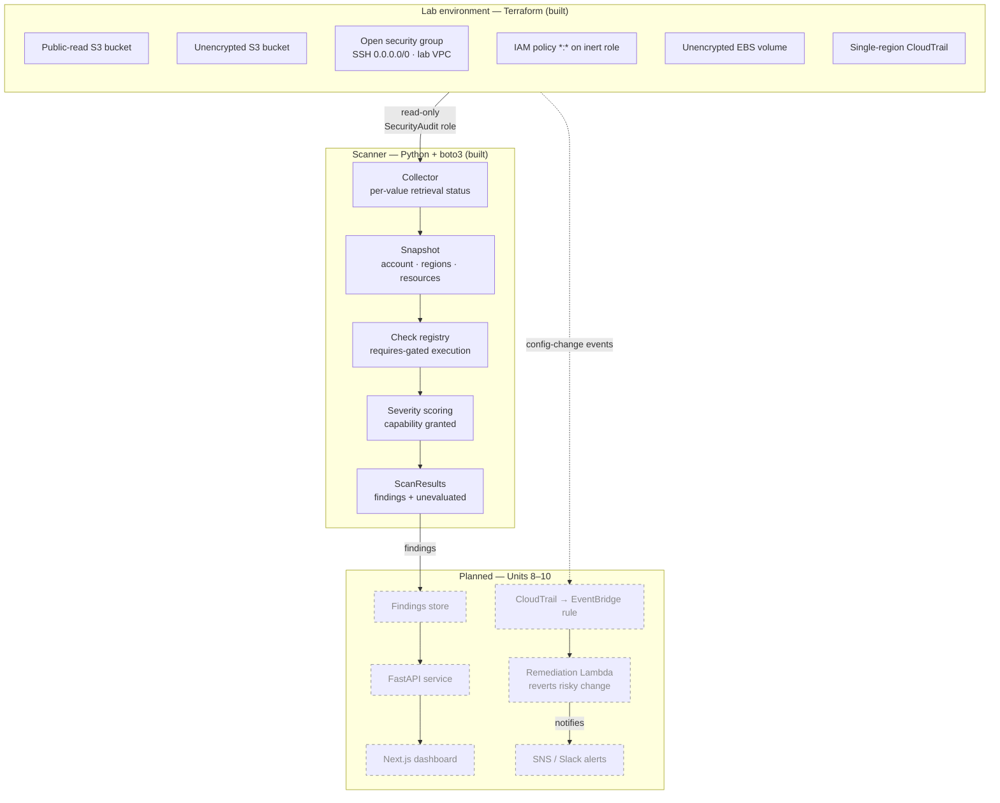

# AWS Security Posture Monitor

A cloud security posture management (CSPM) pipeline that detects AWS misconfigurations against the CIS AWS Foundations Benchmark, prioritizes findings by the capability an attacker gains, and reports honestly on what it could not evaluate.

> **Status: in active development.** The scanner collects from live AWS accounts and runs two CIS checks end to end. Remediation, the findings API, and the dashboard are not built. Sections below are labeled **Built** or **Planned**; the [Roadmap](#roadmap) tracks progress.

---

## Why this exists

Most cloud breaches trace back to configuration, not exotic exploits — a bucket left public, an IAM role with `Action: "*"`, a security group open to the internet on 22. Commercial CSPM tools (Wiz, Prowler, ScoutSuite) solve this well; this project reimplements the core detection loop from scratch to demonstrate the underlying mechanics: how findings are gathered from cloud APIs, mapped to a control framework, scored, and reported.

The design question it takes most seriously is what a scanner does when it *cannot* see something. A tool that reports zero findings because its credentials lacked a permission is more dangerous than one that crashes, because the operator acts on the clean report. Every layer of this scanner distinguishes "I looked and found nothing" from "I could not look."

---

## Architecture



*Solid boxes are implemented. Dashed boxes (remediation, findings store, API, dashboard, alerts) are planned for Units 8–10.*

---

## Features

Legend: **Built** = implemented, tested, and committed · **Planned** = designed, not yet implemented.

- **Framework-mapped detection** *(Built).* Every check cites the CIS AWS Foundations Benchmark v7.0.0 control it enforces, so findings are auditable rather than ad hoc.
- **Honest reporting of blind spots** *(Built).* A check that cannot read a resource records what it could not evaluate and why, and the scan status reflects that incompleteness rather than burying it in an optional field.
- **Capability-based severity** *(Built).* Severity is derived per finding from what the exposed configuration actually grants — a policy allowing `s3:GetObject` and one allowing `s3:*` on the same bucket score differently.
- **Multi-region collection** *(Built).* Regions are collected independently, so a permission failure in one region does not discard results from the others.
- **Reproducible vulnerable lab** *(Built).* The insecure target environment is defined in Terraform, so results are reproducible by anyone cloning the repo.
- **Automated remediation** *(Planned).* A subset of finding types reverted via EventBridge → Lambda.
- **Tooling comparison** *(Planned).* Scanner output benchmarked against Prowler and ScoutSuite to document coverage gaps honestly.

---

## Checks

Control numbers are verified against the CIS AWS Foundations Benchmark **v7.0.0**. Selection and rationale are in [`docs/architecture.md`](docs/architecture.md).

| CIS Control | Check | Status | Severity |
|---|---|---|---|
| 3.1.4 | S3 bucket publicly accessible (policy or ACL) | **Built** | Derived per finding |
| 6.3 | Security group allows `0.0.0.0/0` to admin ports (22, 3389) | **Built** | Critical |
| 2.14 | IAM policy allowing full `*:*` admin privileges is attached | Planned | — |
| 4.1 | CloudTrail not enabled in all regions | Planned | — |
| 2.10 | MFA not enabled for IAM users with a console password | Planned | — |
| 2.12 | Access keys not rotated within 90 days | Planned | — |

**3.1.4** evaluates the full Block Public Access precedence chain: account-level BPA overrides bucket-level, both override the bucket policy and ACL, and Object Ownership determines whether ACL grants have any effect at all. A bucket with `Principal: "*"` in its policy is *not* reported public if BPA blocks it.

**6.3** treats port ranges as ranges (`FromPort: 0, ToPort: 65535` covers 22) and handles `IpProtocol: "-1"`, where AWS omits the port fields entirely because every port on every protocol is open.

---

## Severity model

One factor, three levels, computed per finding from the capability the exposure grants:

| Level | Meaning | Severity | Example |
|---|---|---|---|
| 1 | Read-only access to data | Medium | Bucket policy allowing `s3:GetObject` to `*` |
| 2 | Modify, delete, or re-permission a resource | High | Bucket policy allowing `s3:*`, or an ACL granting `FULL_CONTROL` |
| 3 | Shell or interactive control of a host | Critical | Port 22 or 3389 open to `0.0.0.0/0` |

`LOW` is deliberately unused. Every finding the scanner currently emits is an unintended public exposure; none of them are safe to defer. `LOW` is reserved for controls like access-key age and missing MFA, which are non-compliant but not directly exploitable.

The action allow-list is inverted on purpose: the scanner enumerates the actions it can prove are read-only and scores everything else as level 2. It cannot reliably decide whether an unfamiliar action is dangerous, but it can decide whether one is known-safe. The cost is over-scoring benign actions like `s3:GetBucketLocation` until they are explicitly listed.

Full rationale, including why CVSS was not used, is in [`docs/architecture.md`](docs/architecture.md).

---

## Performance

Measured against a lab account, 4 regions scanned, `us-east-1` client.

| Buckets | Sequential | 10 workers | Speedup |
|---|---|---|---|
| 3 | 2.10s | 2.36s | none |
| 53 | 11.41s | 4.02s | 2.8× |

At small bucket counts concurrency does not help: roughly seven API calls are sequential regardless of bucket count (`sts:GetCallerIdentity`, `s3:ListBuckets`, account-level BPA, and one `ec2:DescribeSecurityGroups` per region), and thread-pool setup costs more than it saves. The per-bucket work — five calls each — is what scales, and that is what the thread pool parallelizes.

The 2.8× figure rather than 10× reflects that fixed overhead: with 53 buckets, most of the ~272 total calls are parallelizable, but the remaining seven still run in series.

---

## Tech stack

| Layer | Technology | Status |
|---|---|---|
| Infrastructure (target lab) | Terraform, AWS | Built |
| Collection | Python, boto3 | Built |
| Detection | Pure functions over a snapshot | Built |
| Tests | pytest, no AWS credentials required | Built |
| Event pipeline | CloudTrail, EventBridge, Lambda | Planned |
| Alerting | SNS, Slack webhook | Planned |
| API | FastAPI | Planned |
| Dashboard | Next.js, TypeScript, Tailwind CSS | Planned |
| CI | GitHub Actions | Planned |

---

## Getting started

### Prerequisites

- A **dedicated** AWS account you are willing to deploy deliberately insecure resources into — see [Safety](#safety)
- Terraform >= 1.6
- Python >= 3.11
- Two AWS profiles: one read-only for scanning, one with write access for Terraform

### 1. Set up credentials

The scanner and the lab deployer are deliberately separate identities. The scanner cannot modify what it scans.

```bash
# Read-only scanner identity — attach the AWS-managed SecurityAudit policy
aws configure

# Lab deployer — needs PowerUserAccess + IAMFullAccess
aws configure --profile terraform
```

### 2. Deploy the vulnerable lab

```bash
cd terraform/
terraform init
terraform apply
```

### 3. Run a scan

```python
from scanner.collector import collect_snapshot
from scanner.runner import run_scan

snapshot = collect_snapshot()
result = run_scan(snapshot)

print(result.status)
for r in result.results:
    print(r.control_id, r.status, len(r.findings))
```

A CLI entrypoint (`python -m scanner`) is not yet implemented.

### 4. Run the tests

```bash
python -m pytest scanner/ -q
```

The suite requires no AWS credentials — checks are pure functions over snapshot fixtures.

### 5. Tear everything down

```bash
cd terraform/
terraform destroy
```

**Always run `terraform destroy` when finished.** Leaving this environment running exposes real, internet-reachable insecure resources under your account.

---

## Sample output

Against the deployed lab, scanning four regions:

```
ScanStatus.COMPLETED
3.1.4 CheckStatus.VIOLATIONS 1
6.3   CheckStatus.VIOLATIONS 1
us-east-1 ok 2
us-east-2 ok 1
us-west-1 ok 1
us-west-2 ok 1
```

The same scan run under an identity lacking `s3:GetBucketPolicy`:

```
ScanStatus.INCOMPLETE
3.1.4 CheckStatus.CANT_EVALUATE 0
6.3   CheckStatus.VIOLATIONS 1
```

Zero S3 findings — and the status says so, rather than reporting a clean environment. The security group check is unaffected because its permissions were intact, so visibility degrades per check rather than all at once.

---

## Repository structure

> Directories marked *(planned)* do not exist yet.

```
.
├── terraform/          # Vulnerable lab environment (built)
│   └── remediation/    # EventBridge rules, Lambda, SNS topic (planned)
├── scanner/
│   ├── collector.py    # boto3 collection → snapshot (built)
│   ├── models.py       # Finding, Severity (built)
│   ├── registry.py     # BaseCheck, CheckResult, check registry (built)
│   ├── runner.py       # Scan orchestration, requires gating (built)
│   ├── scoring.py      # Capability-based severity model (built)
│   ├── fixtures.py     # Snapshot fixtures for tests (built)
│   ├── checks/         # One module per CIS control (built)
│   └── tests/          # pytest suite (built)
├── lambda/             # Remediation handlers (planned)
├── api/                # FastAPI findings service (planned)
├── dashboard/          # Next.js findings UI (planned)
├── docs/               # Architecture notes, design decisions (built)
└── .github/workflows/  # CI (planned)
```

---

## Design decisions

[`docs/architecture.md`](docs/architecture.md) records nine design decisions with their reasoning, rejected alternatives, and costs. The ones that shape everything else:

- **Collect-then-evaluate.** Checks are pure functions over a snapshot and never call boto3. The test suite hands them dictionaries; no credentials, no mocking library.
- **Per-value retrieval status.** Every collected value carries its own status. A bucket with no policy and a bucket whose policy returned `AccessDenied` both have `document: None`; only the status distinguishes them, and conflating them produces a silent false negative.
- **Explicit incompleteness.** `CheckResult` has a `PARTIAL` status and an `unevaluated` list. Incompleteness lives in the field every consumer already reads, not in optional metadata one might forget to check.
- **Deterministic finding IDs.** A SHA-256 digest of account, region, control, resource, and sub-resource — so a suppression made today still matches the same finding tomorrow.

---

## Known gaps

Stated rather than hidden:

- **IPv6 is not checked.** A security group rule opening `::/0` on port 22 is equally public and is currently missed.
- **Regions are hardcoded** to four US regions in the collector. Resources elsewhere are silently unscanned.
- **No API throttling handling.** At current scale the scanner does not hit AWS rate limits, so backoff is untested rather than implemented.
- **No CLI.** Scans run from Python, not a command line.
- **Only two of six planned checks are built.**

---

## Safety

This repository provisions **intentionally insecure AWS infrastructure**. Read before running:

- Deploy only into an isolated sandbox account with no production data and no shared credentials.
- Public S3 buckets and `0.0.0.0/0` security groups are reachable by anyone on the internet, including automated scanners, within minutes of creation.
- Set an AWS Budget alert before applying. Some resources fall outside the free tier.
- Never commit `.tfstate`, `.tfvars`, `credentials`, or `.env` files. See `.gitignore`.
- Destroy the environment as soon as you finish testing.

---

## Roadmap

- [x] Dedicated sandbox account, IAM setup, budget guardrails (Unit 0)
- [x] Threat model and CIS control selection (Unit 1)
- [x] Reproducible vulnerable lab in Terraform (Unit 2)
- [x] Finding model and check registry (Unit 3)
- [x] First checks: S3 public access, open admin ports (Unit 4)
- [x] Capability-based severity model (Unit 5)
- [x] Live collection, multi-region scanning, concurrency (Unit 6)
- [ ] Remaining four checks
- [ ] Full test suite and CI (Unit 7)
- [ ] Auto-remediation for S3 public access and open SSH (Unit 8)
- [ ] Prowler / ScoutSuite coverage comparison (Unit 9)
- [ ] FastAPI findings API + Next.js dashboard (Unit 10)
- [ ] Documentation and portfolio packaging (Unit 11)
- [ ] *Stretch:* multi-account via AWS Organizations, Security Hub (ASFF) export

---

## License

MIT — see [LICENSE](LICENSE).