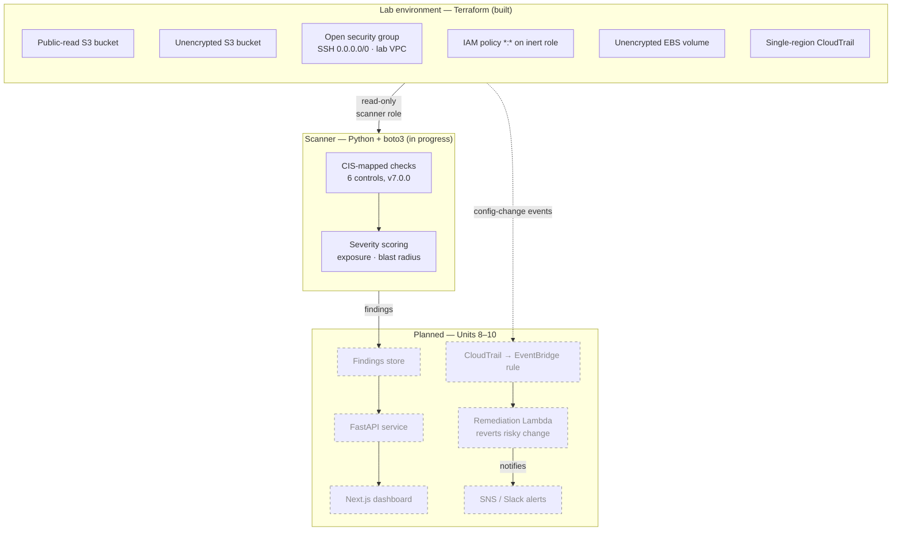

# AWS Security Posture Monitor

A cloud security posture management (CSPM) pipeline that detects AWS misconfigurations against the CIS AWS Foundations Benchmark, prioritizes findings by severity, and automatically remediates a defined subset in near real time.

> **Status: in active development.** This README describes the target design. Only the parts marked **Built** below exist today; everything else is planned and labeled as such. See the [Roadmap](#roadmap) for current progress. Built so far: the Terraform vulnerable lab and the threat model / control selection.

---

## Why this exists

Most cloud breaches trace back to configuration, not exotic exploits — a bucket left public, an IAM role with `Action: "*"`, a security group open to the internet on 22. Commercial CSPM tools (Wiz, Prowler, ScoutSuite) solve this well; this project reimplements the core detection-and-response loop from scratch to demonstrate the underlying mechanics: how findings are gathered from cloud APIs, mapped to a control framework, scored, and driven to closure automatically.

---

## Architecture



*Solid boxes are implemented. Dashed boxes (remediation, findings store, API, dashboard, alerts) are planned for Units 8–10.*

---

## Features

Legend: **Built** = implemented and committed · **Planned** = designed, not yet implemented.

- **Framework-mapped detection** *(Planned).* Every check cites the CIS AWS Foundations Benchmark control it enforces, so findings are auditable rather than ad hoc.
- **Severity scoring** *(Planned).* Findings are ranked (Critical / High / Medium / Low) based on exposure and blast radius, not just check type.
- **Automated remediation** *(Planned).* A subset of finding types are reverted automatically via EventBridge → Lambda, closing the loop between detection and response.
- **Reproducible vulnerable lab** *(Built).* The insecure target environment is defined in Terraform, so results are reproducible by anyone cloning the repo.
- **Tooling comparison** *(Planned).* Scanner output is benchmarked against Prowler and ScoutSuite to document coverage gaps honestly.

---

## Planned checks (v1)

> **None of these run yet.** This is the v1 detection set, selected and justified in [`docs/architecture.md`](docs/architecture.md). Control numbers are verified against the CIS AWS Foundations Benchmark **v7.0.0**. The scanner interface that will execute these is under construction.

| CIS Control | Check | Planned severity | Auto-remediation |
|---|---|---|---|
| 3.1.4 | S3 bucket not configured with Block Public Access | Critical | Planned |
| 6.3 | Security group allows `0.0.0.0/0` to remote admin ports (SSH) | Critical | Planned |
| 2.14 | IAM policy allowing full `*:*` admin privileges is attached | High | No |
| 4.1 | CloudTrail not enabled in all regions | High | No |
| 2.10 | MFA not enabled for IAM users with a console password | High | No |
| 2.12 | Access keys not rotated within 90 days | Medium | No |

---

## Tech stack

Layers marked *(planned)* are not yet implemented.

| Layer | Technology |
|---|---|
| Infrastructure (target lab) | Terraform, AWS — **built** |
| Detection | Python 3.11, boto3 — *in progress* |
| Event pipeline | CloudTrail, EventBridge, Lambda — *planned* |
| Alerting | SNS, Slack webhook — *planned* |
| API | FastAPI — *planned* |
| Dashboard | Next.js, TypeScript, Tailwind CSS — *planned* |
| CI | GitHub Actions (lint, `terraform validate`, unit tests) — *planned* |

---

## Getting started

### Prerequisites

- An AWS account you are willing to deploy deliberately insecure resources into — see [Safety](#safety)
- AWS CLI configured with credentials (`aws configure`)
- Terraform >= 1.6
- Python >= 3.11 *(for the scanner, once implemented)*

### 1. Deploy the vulnerable lab — **available now**

```bash
cd terraform/
terraform init
terraform plan
terraform apply
```

### 2. Run a scan — *planned (Units 3–6)*

```bash
# Not yet implemented.
cd scanner/
pip install -r requirements.txt
python -m scanner --region us-east-1 --output findings.json
```

### 3. Deploy the remediation pipeline — *planned (Unit 8)*

```bash
# Not yet implemented.
cd terraform/remediation/
terraform apply
```

### 4. Run the dashboard — *planned (Unit 10)*

```bash
# Not yet implemented.
cd api/ && uvicorn main:app --reload
cd dashboard/ && npm install && npm run dev
```

### 5. Tear everything down

```bash
cd terraform/
terraform destroy
```

**Always run `terraform destroy` when finished.** Leaving this environment running exposes real, internet-reachable insecure resources under your account.

---

## Sample output

*Will be added once the first checks run (Unit 4).*

---

## Repository structure

> Directories marked *(planned)* do not exist yet; they describe the intended layout.

```
.
├── terraform/          # Vulnerable lab environment (built)
│   └── remediation/    # EventBridge rules, Lambda, SNS topic (planned)
├── scanner/            # Python detection engine (in progress)
│   ├── checks/         # One module per CIS control (planned)
│   └── scoring.py      # Severity model (planned)
├── lambda/             # Remediation handlers (planned)
├── api/                # FastAPI findings service (planned)
├── dashboard/          # Next.js findings UI (planned)
├── docs/               # Architecture notes, threat model (built)
└── .github/workflows/  # CI (planned)
```

---

## Safety

This repository provisions **intentionally insecure AWS infrastructure**. Read before running:

- Deploy only into an isolated sandbox account with no production data and no shared credentials.
- Public S3 buckets and `0.0.0.0/0` security groups are reachable by anyone on the internet, including automated scanners, within minutes of creation.
- Set an AWS Budget alert before applying. Some resources fall outside the free tier.
- Never commit `.tfstate`, `.tfvars`, `credentials`, or `.env` files. See `.gitignore`.
- Destroy the environment as soon as you finish testing.

---

## Roadmap

- [x] Dedicated sandbox account, IAM setup, budget guardrails (Unit 0)
- [x] Threat model and CIS control selection (Unit 1)
- [x] Reproducible vulnerable lab in Terraform (Unit 2)
- [ ] Finding model and check registry (Unit 3)
- [ ] First checks: S3 public, S3 encryption, open SSH (Unit 4)
- [ ] Severity scoring model (Unit 5)
- [ ] Full six-check set + multi-region scanning (Unit 6)
- [ ] Test suite and CI (Unit 7)
- [ ] Auto-remediation for S3 public access and open SSH (Unit 8)
- [ ] Prowler / ScoutSuite coverage comparison (Unit 9)
- [ ] FastAPI findings API + Next.js dashboard (Unit 10)
- [ ] Documentation and portfolio packaging (Unit 11)
- [ ] *Stretch:* multi-account via AWS Organizations, Security Hub (ASFF) export

---

## License

MIT — see [LICENSE](LICENSE).