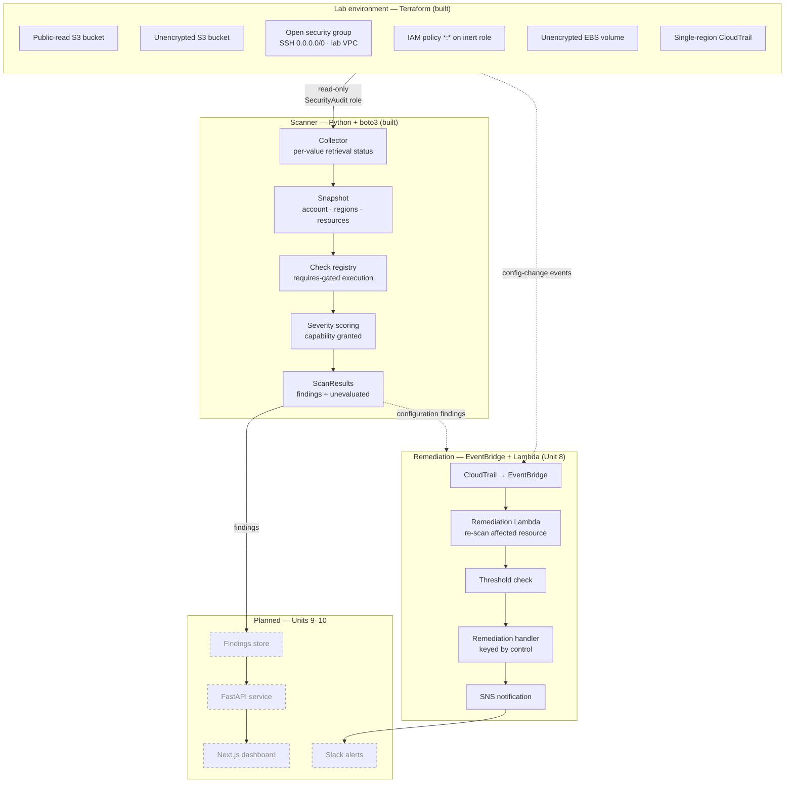

# AWS Security Posture Monitor

[](https://github.com/DevAnnafi/AWS-Security-Posture-Monitor/actions/workflows/ci.yml)

A cloud security posture management (CSPM) pipeline that detects AWS misconfigurations against the CIS AWS Foundations Benchmark, prioritizes findings by the capability an attacker gains, and reports honestly on what it could not evaluate.

> **Status: in active development.** The scanner collects from live AWS accounts and runs three CIS checks end to end, with 39 tests running in CI. Remediation is built and functional. The findings API and the dashboard are not built. Sections below are labeled **Built** or **Planned**; the [Roadmap](#roadmap) tracks progress.

---

## Why this exists

Most cloud breaches trace back to configuration, not exotic exploits — a bucket left public, an IAM role with `Action: "*"` , a security group open to the internet on 22. Commercial CSPM tools (Wiz, Prowler, ScoutSuite) solve this well; this project reimplements the core detection loop from scratch to demonstrate the underlying mechanics: how findings are gathered from cloud APIs, mapped to a control framework, scored, and reported.

The design question it takes most seriously is what a scanner does when it **cannot** see something. A tool that reports zero findings because its credentials lacked a permission is more dangerous than one that crashes, because the operator acts on the clean report. Every layer of this scanner distinguishes "I looked and found nothing" from "I could not look."

---

## Architecture



**Solid boxes are implemented.** Remediation is implemented as part of Unit 8; the findings store, API, dashboard, and Slack alerting remain planned.

---

## Features

Legend: **Built** = implemented, tested, and committed · **Planned** = designed, not yet implemented.

* **Framework-mapped detection** *(Built).* Every check cites the CIS AWS Foundations Benchmark v7.0.0 control it enforces, so findings are auditable rather than ad hoc.
* **Honest reporting of blind spots** *(Built).* A check that cannot read a resource records what it could not evaluate and why, and the scan status reflects that incompleteness rather than burying it in an optional field.
* **Capability-based severity** *(Built).* Severity is derived per finding from what the exposed configuration actually grants — a policy allowing `s3:GetObject` and one allowing `s3:*` on the same bucket score differently.
* **Multi-region collection** *(Built).* Regions are collected independently, so a permission failure in one region does not discard results from the others.
* **Credential-free test suite** *(Built).* 39 tests run in CI with no AWS configuration, including collector error branches that a modern AWS account cannot produce.
* **Reproducible vulnerable lab** *(Built).* The insecure target environment is defined in Terraform, so results are reproducible by anyone cloning the repo.
* **Threshold-based auto-remediation** *(Built).* A subset of findings can be automatically reverted through EventBridge → Lambda when the finding meets the remediation threshold.
* **Re-scan before remediation** *(Built).* The remediation Lambda reads the affected resource again and runs the detection logic before making a change.
* **Control-keyed remediation** *(Built).* Remediation handlers are separate from detection checks and are selected by control ID because detection and remediation run in different execution contexts.
* **Tooling comparison** *(Planned).* Scanner output benchmarked against Prowler and ScoutSuite to document coverage gaps honestly.

---

## Checks

Control numbers are verified against the CIS AWS Foundations Benchmark **v7.0.0**. Selection and rationale are in [`docs/architecture.md`](docs/architecture.md).

| CIS Control | Check | Status | Severity | Auto-remediation |
| --- | --- | --- | --- | --- |
| 3.1.4 | S3 bucket publicly accessible (policy or ACL) | **Built** | Derived per finding | Enables all four BPA flags |
| 6.3 | Security group allows `0.0.0.0/0` to admin ports (22, 3389) | **Built** | Critical | Exact admin ports only |
| 2.14 | IAM policy allowing full `*:*` admin privileges is attached | **Built** | Critical | Detect-only |
| 4.1 | CloudTrail not enabled in all regions | Planned | — | — |
| 2.10 | MFA not enabled for IAM users with a console password | Planned | — | — |
| 2.12 | Access keys not rotated within 90 days | Planned | — | — |

**3.1.4** evaluates the full Block Public Access precedence chain: account-level BPA overrides bucket-level, both override the bucket policy and ACL, and Object Ownership determines whether ACL grants have any effect at all. A bucket with `Principal: "*"` in its policy is **not** reported public if BPA blocks it.

**6.3** treats port ranges as ranges (`FromPort: 0, ToPort: 65535` covers 22) and handles `IpProtocol: "-1"`, where AWS omits the port fields entirely because every port on every protocol is open.

**2.14** identifies attached IAM policies granting `Action: "*"` on `Resource: "*"`. Service-specific wildcards such as `s3:*` do not qualify as full administrative access, and unattached policies are not reported — though they are still collected, so a future control could flag dormant admin policies.

---

## Remediation

Remediation runs separately from the normal detection scan.

A configuration-change event is delivered through CloudTrail and EventBridge to the remediation Lambda. The Lambda does **not** trust the event payload as proof that the finding still exists. It re-reads the affected AWS resource and runs the same detection implementation used by the scanner.

```text
AWS configuration change
        │
        ▼
    CloudTrail
        │
        ▼
   EventBridge
        │
        ▼
 Remediation Lambda
        │
        ▼
 Re-scan affected resource
        │
        ▼
 Does violation still exist?
        │
        ├───────────────┐
        │               │
       yes              no
        │               │
        ▼               ▼
 Threshold check       Stop
        │
        ├───────────────┐
        │               │
      safe           outside
        │           threshold
        ▼               │
   Remediate            ▼
        │              SNS
        ▼
       SNS
```

### Why the Lambda re-scans

The EventBridge event identifies the configuration change, but the resource may have changed again before the Lambda executes. Re-scanning means the remediation decision is based on the resource's current state.

It also keeps detection in one implementation. The Lambda does not maintain a second copy of the logic used to decide whether a configuration violates a control.

The trade-off is additional AWS API calls per invocation. The Lambda therefore needs read permissions as well as the write permissions required for remediation.

### Remediation handlers

Detection and remediation are separate.

Checks are pure functions over a snapshot and do not modify AWS resources. Remediation handlers run inside Lambda with write credentials and are registered by CIS control ID.

The Lambda ships the complete scanner package anyway, so separating remediation from checks does **not** reduce deployment size. The separation exists because the two operations have different execution contexts, permissions, and responsibilities.

### What each control does

| Control | Finding | Auto-remediation |
| --- | --- | --- |
| **3.1.4** | Public S3 access | Enables all four Block Public Access (BPA) flags (additive, not destructive) |
| **6.3** | `0.0.0.0/0` on TCP 22 or 3389 | Exact administrative-port rules can be remediated |
| **2.14** | Attached `*:*` IAM policy | **Detect-only** |

### 6.3 remediation threshold

Security-group remediation is intentionally narrow.

An exact administrative-port rule is eligible when TCP port **22** or **3389** is exposed to `0.0.0.0/0`.

Broad ranges generate findings but are not automatically changed. For example:

```text
FromPort: 0
ToPort: 65535
```

covers port 22, but automatically replacing or deleting the rule would require assuming that the entire range was created accidentally.

`IpProtocol: "-1"` is also **never** automatically remediated. It represents unrestricted protocol and port access, but changing such a rule automatically would make a broader assumption about the intended network configuration.

The answer to "when would auto-remediation cause an outage?" is when the scanner changes a rule that was intentionally required by an application or administrator. The threshold therefore favors a narrow, specific corrective action over automatically changing every configuration that contains an exposure.

The cost is that some dangerous configurations remain for manual remediation.

### 2.14 is detect-only

CIS 2.14 detects attached IAM policies granting full `*:*` administrative privileges, but it does not automatically detach the policy.

An administrative policy may be intentional and may support a legitimate workload, deployment system, or administrator. The scanner can establish that the policy violates the benchmark, but it cannot establish from the finding alone that removing the policy is operationally safe.

A remediation that causes an outage is worse than leaving the finding for manual review. IAM 2.14 therefore remains detect-only.

### Remediation timing

**Time from misconfiguration to remediation: ~8 seconds**

CloudTrail → EventBridge → Lambda invocation: ~6s
Lambda execution (re-scan, revoke, notify): ~2s

This is one measurement; delivery latency varies.

### Sample SNS notification

```json
{   "message": "CSPM remediation attempted", 
    "resource": "sg-07dfce1d80df89537", 
    "control_id": "6.3", 
    "event": {"eventName": "AuthorizeSecurityGroupIngress", "eventSource": "ec2.amazonaws.com", "eventTime": "2026-09-11T05:31:30Z", "region": "us-east-1"}, 
    "triggered_by": {"type": "IAMUser", "arn": "arn:aws:iam::339712764484:user/terraform-deploy", "userName": "terraform-deploy"}, 
    "remediation": {"status": "ok", "revoked_rules": 1}
}
```

---

## Severity model

One factor, three levels, computed per finding from the capability the exposure grants:

| Level | Meaning | Severity | Example |
| --- | --- | --- | --- |
| 1 | Read-only access to data | Medium | Bucket policy allowing `s3:GetObject` to `*` |
| 2 | Modify, delete, or re-permission a resource | High | Bucket policy allowing `s3:*`, or an ACL granting `FULL_CONTROL` |
| 3 | Shell or interactive control of a host | Critical | Port 22 or 3389 open to `0.0.0.0/0` |

`LOW` is deliberately unused. Every finding the scanner currently emits is an unintended public exposure; none of them are safe to defer. `LOW` is reserved for controls like access-key age and missing MFA, which are non-compliant but not directly exploitable.

The action allow-list is inverted on purpose: the scanner enumerates the actions it can prove are read-only and scores everything else as level 2. It cannot reliably decide whether an unfamiliar action is dangerous, but it can decide whether one is known-safe. The cost is over-scoring benign actions like `s3:GetBucketLocation` until they are explicitly listed.

Full rationale, including why CVSS was not used, is in [`docs/architecture.md`](docs/architecture.md).

---

## Performance

Measured against a lab account, 4 regions scanned, `us-east-1` client.

| Buckets | Sequential | 10 workers | Speedup |
| --- | ---: | ---: | ---: |
| 3 | 2.10s | 2.36s | none |
| 53 | 11.41s | 4.02s | 2.8× |

At small bucket counts concurrency does not help: roughly seven API calls are sequential regardless of bucket count (`sts:GetCallerIdentity`, `s3:ListBuckets`, account-level BPA, and one `ec2:DescribeSecurityGroups` per region), and thread-pool setup costs more than it saves. The per-bucket work — five calls each — is what scales, and that is what the thread pool parallelizes.

The 2.8× figure rather than 10× reflects that fixed overhead: with 53 buckets, most of the ~272 total calls are parallelizable, but the remaining seven still run in series.

---

## Testing

39 tests, no AWS credentials required, running in GitHub Actions on every push and pull request.

Three layers, each covering what the others cannot:

| Layer | Covers | Blind to |
| --- | --- | --- |
| Snapshot fixtures | Check logic, precedence rules, severity derivation | Real AWS response shapes |
| `botocore.stub.Stubber` | Collector error handling and response parsing | Whether error codes match reality |
| Live account runs | Real response shapes, error codes, permission boundaries | Branches the account cannot produce |

The credential-free property is not incidental. Checks are pure functions over a snapshot dictionary and never call boto3, so the suite has nothing to authenticate against. CI on a runner with no AWS configuration is what verifies that claim.

Two collector branches are tested despite being unreachable in a modern account: `NoSuchPublicAccessBlockConfiguration` at the bucket level and `OwnershipControlsNotFoundError`. AWS configures both on every bucket created since 2023, so only legacy resources can trigger them — which is exactly where old misconfigurations live.

---

## Tech stack

| Layer | Technology | Status |
| --- | --- | --- |
| Infrastructure (target lab) | Terraform, AWS | Built |
| Collection | Python, boto3 | Built |
| Detection | Pure functions over a snapshot | Built |
| Tests | pytest, botocore Stubber | Built |
| CI | GitHub Actions | Built |
| Event pipeline | CloudTrail, EventBridge, Lambda | Built |
| Remediation | Python handlers keyed by CIS control | Built |
| Alerting | SNS, Slack webhook | SNS built / Slack planned |
| API | FastAPI | Planned |
| Dashboard | Next.js, TypeScript, Tailwind CSS | Planned |

---

## Getting started

### Prerequisites

* A **dedicated** AWS account you are willing to deploy deliberately insecure resources into — see [Safety](#safety)
* Terraform >= 1.6
* Python >= 3.11
* Two AWS profiles: one read-only for scanning, one with write access for Terraform

### 1. Set up credentials

The scanner and the lab deployer are deliberately separate identities. The scanner cannot modify what it scans.

```bash
# Read-only scanner identity — attach the AWS-managed SecurityAudit policy
aws configure
# Lab deployer — needs PowerUserAccess + IAMFullAccess
aws configure --profile terraform
```

### 2. Deploy the vulnerable lab

```bash
cd terraform/
terraform init
terraform apply
```

### 3. Run a scan

```python
from scanner.collector import collect_snapshot
from scanner.runner import run_scan

snapshot = collect_snapshot()
result = run_scan(snapshot)
print(result.status)
for r in result.results:
    print(r.control_id, r.status, len(r.findings))
```

A CLI entrypoint (`python -m scanner`) is not yet implemented.

### 4. Run the tests

```bash
python -m pytest scanner/ -q
```

No AWS credentials needed.

### 5. Tear everything down

```bash
cd terraform/
terraform destroy
```

**Always run `terraform destroy` when finished.** Leaving this environment running exposes real, internet-reachable insecure resources under your account.

---

## Sample output

Against the deployed lab, scanning four regions:

```text
ScanStatus.COMPLETED
3.1.4 CheckStatus.VIOLATIONS 1
6.3   CheckStatus.VIOLATIONS 1
2.14  CheckStatus.VIOLATIONS 1
us-east-1 ok 2
us-east-2 ok 1
us-west-1 ok 1
us-west-2 ok 1
```

The same scan run under an identity lacking `s3:GetBucketPolicy`:

```text
ScanStatus.INCOMPLETE
3.1.4 CheckStatus.CANT_EVALUATE 0
6.3   CheckStatus.VIOLATIONS 1
2.14  CheckStatus.VIOLATIONS 1
```

Zero S3 findings — and the status says so, rather than reporting a clean environment. The security group and IAM checks are unaffected because their permissions were intact, so visibility degrades per check rather than all at once.

---

## Repository structure

> Directories marked **planned** do not exist yet.

```text
.
├── terraform/              # Vulnerable lab environment (built)
│   └── remediation/        # EventBridge rules, Lambda, SNS topic
├── scanner/
│   ├── collector.py        # boto3 collection → snapshot (built)
│   ├── models.py           # Finding, Severity (built)
│   ├── registry.py         # BaseCheck, CheckResult, check registry (built)
│   ├── runner.py           # Scan orchestration, requires gating (built)
│   ├── scoring.py          # Capability-based severity model (built)
│   ├── fixtures.py         # Snapshot fixtures for tests (built)
│   ├── checks/             # One module per CIS control (built)
│   └── tests/              # pytest suite (built)
├── lambda_functions/       # Remediation handlers (built)
├── api/                    # FastAPI findings service (planned)
├── dashboard/              # Next.js findings UI (planned)
├── docs/                   # Architecture notes, design decisions (built)
└── .github/workflows/      # CI (built)
```

---

## Design decisions

[`docs/architecture.md`](docs/architecture.md) records thirteen design decisions with their reasoning, rejected alternatives, and costs. The ones that shape everything else:

* **Collect-then-evaluate.** Checks are pure functions over a snapshot and never call boto3. The test suite hands them dictionaries; no credentials, no mocking library.
* **Per-value retrieval status.** Every collected value carries its own status. A bucket with no policy and a bucket whose policy returned `AccessDenied` both have `document: None`; only the status distinguishes them, and conflating them produces a silent false negative.
* **Explicit incompleteness.** `CheckResult` has a `PARTIAL` status and an `unevaluated` list. Incompleteness lives in the field every consumer already reads, not in optional metadata one might forget to check.
* **Deterministic finding IDs.** A SHA-256 digest of account, region, control, resource, and sub-resource — so a suppression made today still matches the same finding tomorrow.
* **Separate remediation handlers.** Detection checks remain pure and remediation handlers run separately in the Lambda execution context, with handlers selected by control ID. The scanner package is shipped to Lambda as a whole, so the separation is for execution boundaries rather than deployment-size savings.
* **Re-scan before remediation.** The Lambda reads the affected resource again and runs the same detection implementation before modifying it. This costs additional API calls and requires read permissions in the remediation role, but avoids trusting potentially stale event data.
* **Threshold-based auto-remediation.** Automatic changes are limited to narrowly defined conditions. Security-group remediation covers exact TCP 22 and 3389 exposures; broad ranges and `IpProtocol: "-1"` generate findings but are not automatically changed.
* **2.14 is detect-only.** Detaching an administrative IAM policy could break a legitimate workload or administrator. The project treats a remediation that causes an outage as worse than leaving the finding for manual review.

---

## Known gaps

Stated rather than hidden:

* **IPv6 is not checked.** A security group rule opening `::/0` on port 22 is equally public and is currently missed.
* **`NotAction` is not handled.** A policy statement with `NotAction: ["iam:*"]` and `Resource: "*"` grants everything except IAM — effectively admin, and check 2.14 misses it.
* **Regions are hardcoded** to four US regions in the collector. Resources elsewhere are silently unscanned.
* **No integration test.** The collector and the checks are each tested; the seam between them is not.
* **No coverage measurement.** The paths believed to be covered and the paths that actually execute are not guaranteed to be the same set.
* **No API throttling handling.** At current scale the scanner does not hit AWS rate limits, so backoff is untested rather than implemented.
* **No CLI.** Scans run from Python, not a command line.
* **Three of six planned checks are built.**
* **Remediation coverage is intentionally narrow.** Only specific finding conditions are eligible for automatic changes. Other findings require manual review.

---

## Safety

This repository provisions **intentionally insecure AWS infrastructure**. Read before running:

* Deploy only into an isolated sandbox account with no production data and no shared credentials.
* Public S3 buckets and `0.0.0.0/0` security groups are reachable by anyone on the internet, including automated scanners, within minutes of creation.
* Set an AWS Budget alert before applying. Some resources fall outside the free tier.
* Never commit `.tfstate`, `.tfvars`, `credentials`, or `.env` files. See `.gitignore`.
* Destroy the environment as soon as you finish testing.

---

## Roadmap

* [x] Dedicated sandbox account, IAM setup, budget guardrails (Unit 0)
* [x] Threat model and CIS control selection (Unit 1)
* [x] Reproducible vulnerable lab in Terraform (Unit 2)
* [x] Finding model and check registry (Unit 3)
* [x] First checks: S3 public access, open admin ports (Unit 4)
* [x] Capability-based severity model (Unit 5)
* [x] Live collection, multi-region scanning, concurrency (Unit 6)
* [x] IAM wildcard policy check — CIS 2.14 (Unit 6)
* [x] Test suite and CI (Unit 7)
* [x] EventBridge → Lambda remediation flow (Unit 8)
* [x] Re-scan before remediation (Unit 8)
* [x] Threshold-based auto-remediation for supported S3 and security-group findings (Unit 8)
* [x] SNS remediation notifications (Unit 8)
* [ ] Remaining three checks
* [ ] Prowler / ScoutSuite coverage comparison (Unit 9)
* [ ] FastAPI findings API + Next.js dashboard (Unit 10)
* [ ] Documentation and portfolio packaging (Unit 11)
* [ ] **Stretch:** multi-account via AWS Organizations, Security Hub (ASFF) export

---

## License

MIT — see [LICENSE](LICENSE).